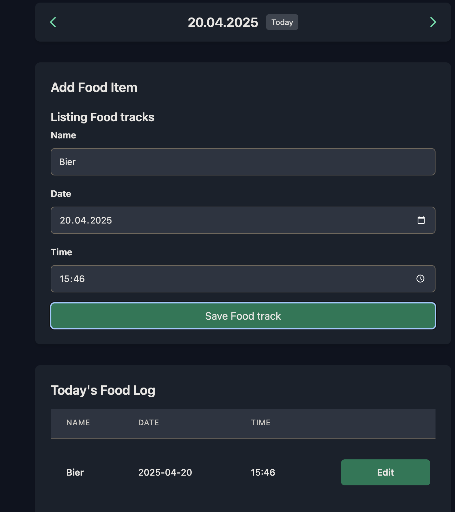

# Munch Metrics

A modern, real-time food tracking application built with Phoenix LiveView. Track your meals easily with a responsive interface.

Demo: https://munchmetrics.vossihub.org/



## Todos

[x] Make sure db is persistent when running new container
[x] Fix Today's Food Log scroll bars / layout
[ ] Always default to the current date and time
[ ] Implement anonymous user functionality

## Anonymous User Access Implementation Plan

The goal is to allow users to try out the app without registration, only prompting them to create an account after they start saving food tracks.

### Phase 1: Preparation and Testing (Current Focus)

1. **Fix Existing Tests**

   - [x] Update food tracking tests to include user_id requirement
   - [x] Ensure all tests pass with current implementation

2. **Design Database Changes**

   - Add `anonymous_uuid` field to users table
   - Add `is_anonymous` boolean field to users table
   - Add `last_active_at` timestamp field to users table
   - Create database migration

3. **Write New Tests**
   - Test anonymous user creation
   - Test anonymous user to registered user conversion
   - Test inactive anonymous user cleanup
   - Test session preservation during conversion

### Phase 2: Core Implementation

4. **Update Authentication System**

   - Modify router to allow public access to home and monthly pages
   - Create anonymous user module and plug
   - Implement anonymous user tracking via cookies
   - Update LiveView hooks to handle anonymous users

5. **Track Anonymous Users**

   - Set cookie with UUID for anonymous users
   - Create anonymous user accounts when saving first food track
   - Update last_active_at on each page visit

6. **User Conversion Workflow**
   - Add functionality to convert anonymous users to registered users
   - Preserve existing food tracking data during conversion
   - Update email confirmation process to handle anonymous users

### Phase 3: UI and Cleanup

7. **UI Notifications**

   - Add persistent banner for anonymous users
   - Show clear notification about data persistence limitations
   - Provide easy path to registration

8. **Implement Cleanup Job**

   - Create periodic task to clean up inactive anonymous accounts
   - Set up 30-day inactivity threshold matching cookie duration
   - Add logging for account cleanup

9. **Update Privacy and Terms**
   - Update privacy policy to address anonymous user data
   - Document data retention policies for anonymous accounts

### Phase 4: Testing and Launch

10. **Final Testing**

    - Verify all user flows (anonymous → registered)
    - Test edge cases for authentication
    - Test data persistence through conversion

11. **Deploy and Monitor**
    - Deploy changes
    - Monitor anonymous user conversion rates
    - Track any issues with database performance

## For Users

### Features

- Simple and intuitive food tracking
- Daily tracking view for detailed meal logging
- Monthly overview to visualize eating patterns
- Dark mode support for comfortable viewing
- Responsive design that works on all devices
- Secure user authentication

### Getting Started

1. Create an account or log in
2. Use the "Tracking" view for daily meal logging
   - Add meals with name, date, and time
3. Switch to "Monthly View" to see your eating patterns
   - Navigate between months easily
   - Today's date is highlighted for quick reference

## For Developers

### Tech Stack

- **Framework**: Phoenix LiveView
- **Language**: Elixir
- **Database**: SQLite3
- **Frontend**: Tailwind CSS
- **Authentication**: Built-in Phoenix authentication

### Prerequisites

- Elixir 1.14 or later
- Erlang/OTP 25 or later
- SQLite3

### Local Development Setup

1. Clone the repository
2. Install dependencies:
   ```bash
   mix setup
   ```
3. Start Phoenix server:
   ```bash
   mix phx.server
   ```
4. Visit [`localhost:4000`](http://localhost:4000) from your browser

### Project Structure

- `lib/food_tracker/food__tracking/` - Core food tracking context and schema
- `lib/food_tracker_web/live/` - LiveView components and templates
- `lib/food_tracker_web/components/` - Reusable UI components
- `priv/repo/migrations/` - Database migrations
